# Expenso — Family Expense Tracker

A mobile-first family expense tracker where multiple household members share and record shared spending and income, built on [Frappe](https://frappeframework.com).

## Screenshots

| Login | Feed | Analytics |
|---|---|---|
| 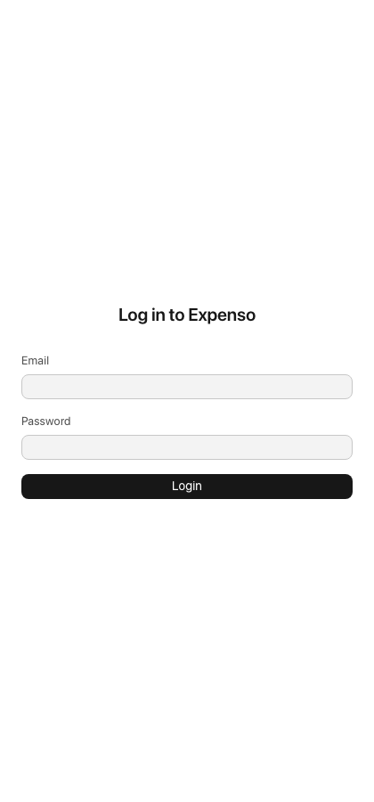 | 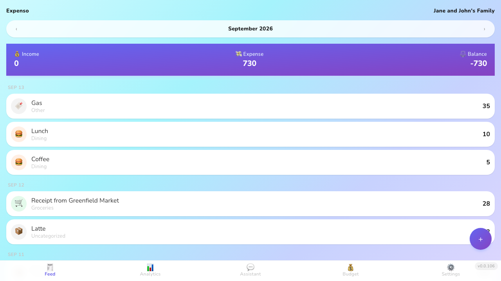 | 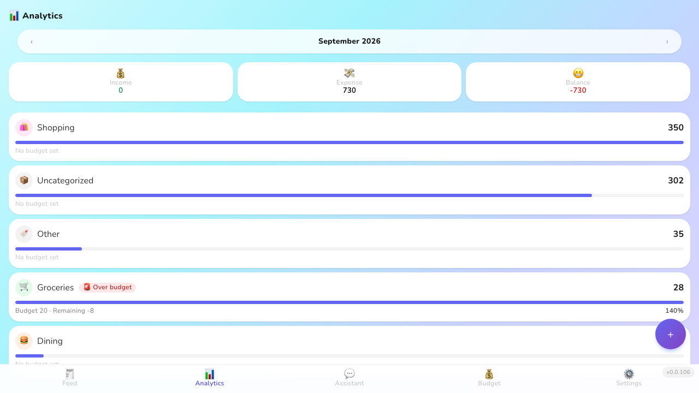 |

| Add Expense | Add Income | Edit Expense |
|---|---|---|
| 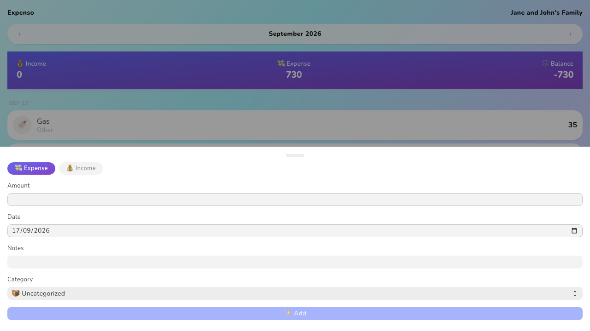 | 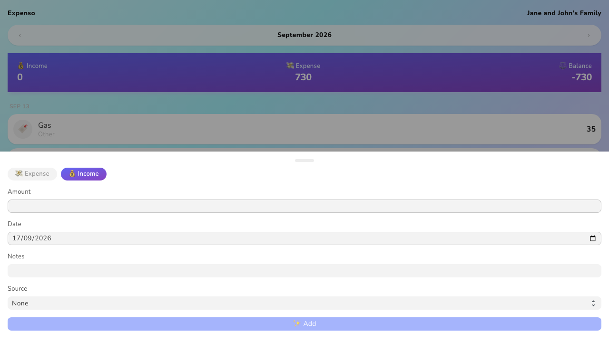 | 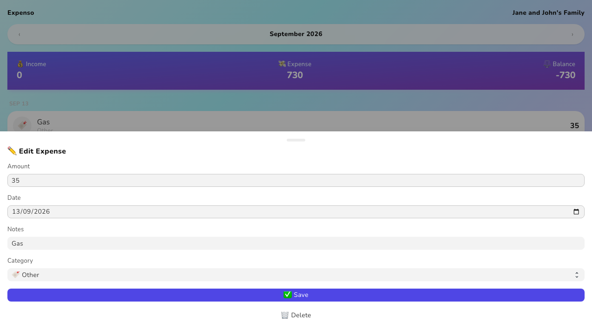 |

The Feed's + button opens the Add Expense sheet directly; the Expense/Income tab switcher inside it reaches Add Income without a second tap.

| Budget | Settings |
|---|---|
| 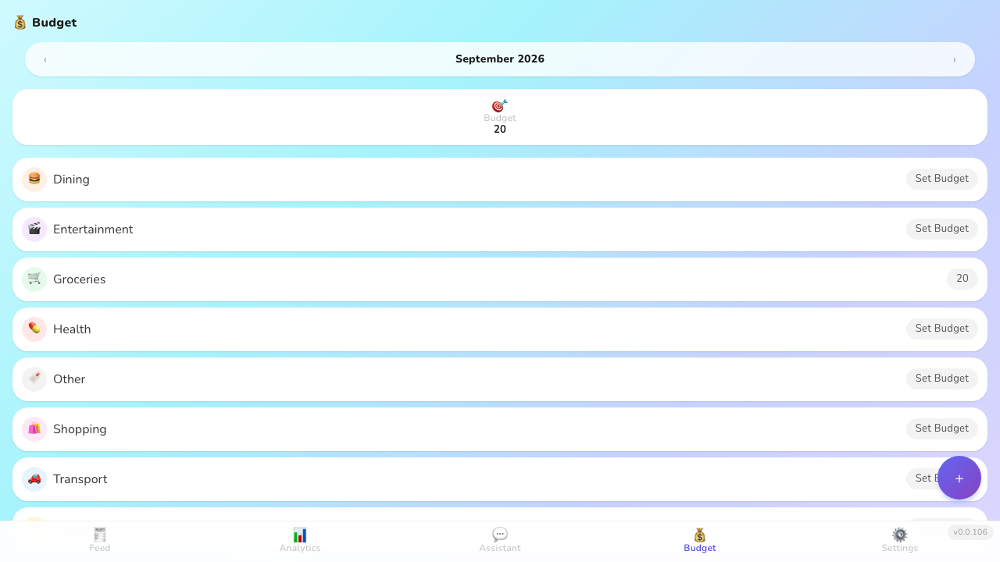 | 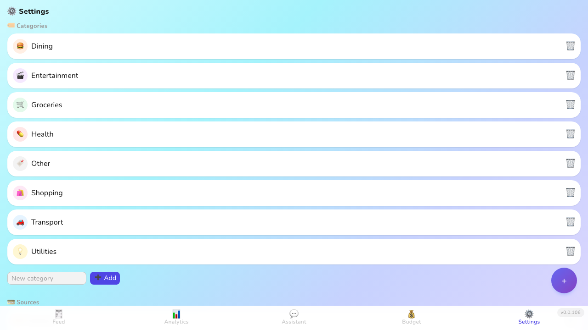 |

## Features

- **Feed** — home screen showing the Family's Expenses for the selected month, grouped by date with a compact monthly total; prev/next month navigation
- **Analytics** — read-only monthly summary: total Expenses, Income, and Savings (net), with a per-Category breakdown against that Category's Budget and its Budget Status (Warning at ≥80% spent, Exceeded at ≥100%)
- **Budget** — a dedicated screen for setting each Category's spending cap for the selected month; unset months auto-fill by carrying forward the most recent earlier amount
- **Settings** — the single surface for managing a Family's Category and Source lists (add, rename, delete)
- **Shared Feed** — any Member can create, edit, or delete any Expense or Income belonging to their Family; the Feed refreshes live over Frappe's WebSocket when another Member makes a change, no manual refresh needed

## User Roles

| Role | Access |
|---|---|
| **Family Member** | Create, edit, and delete Expenses/Income for their own Family; manage their Family's Categories, Sources, and Budgets |

Admin sets up all accounts through Frappe Desk — there's no self-service signup.

## Admin Setup (one-time per family)

1. **Create a User** for each household member: `Desk → User → New`. Uncheck "Send Welcome Email" if the address is a placeholder.
2. On each User's **Roles & Permissions** tab, check the **Family Member** role — without it, the Member can't log in to the app or access their Family's data.
3. **Create a Family**: `Desk → Expenso → Family → New`. Set a Family Name and Currency, then add each User under Members.
4. **Save.** Default Categories (Groceries, Dining, Transport, Utilities, Health, Entertainment, Shopping, Other) and Sources (Salary, Freelance, Rental, Other) are seeded automatically — visible under Connections on the Family.
5. Members can now log in at the site URL and land on their shared Feed.

| New User | Assign "Family Member" role |
|---|---|
| 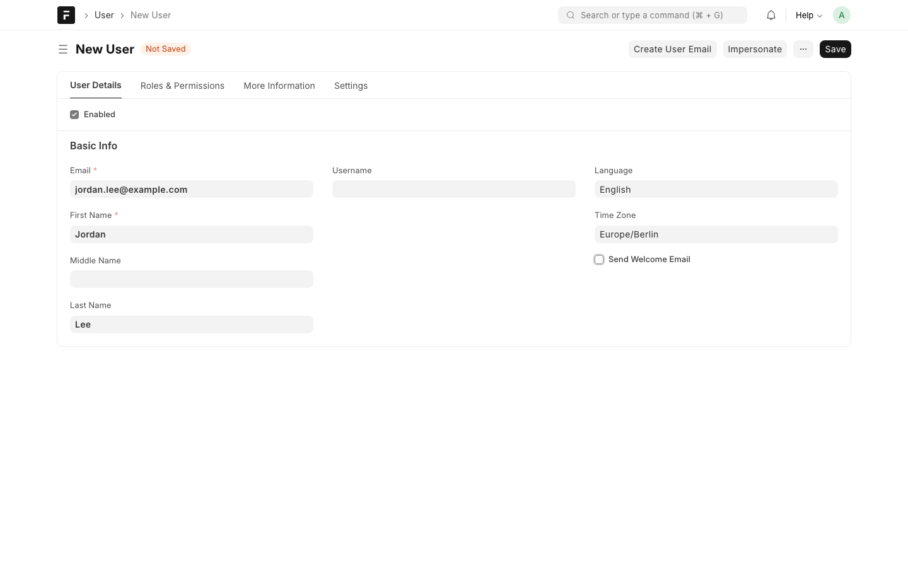 | 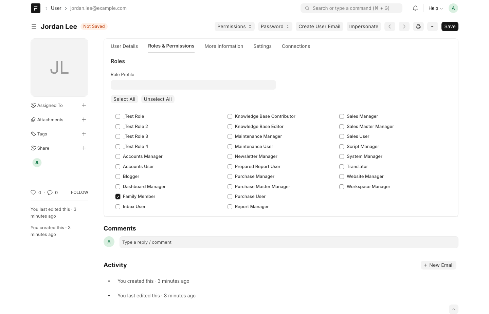 |

| New Family | Family created — defaults seeded |
|---|---|
| 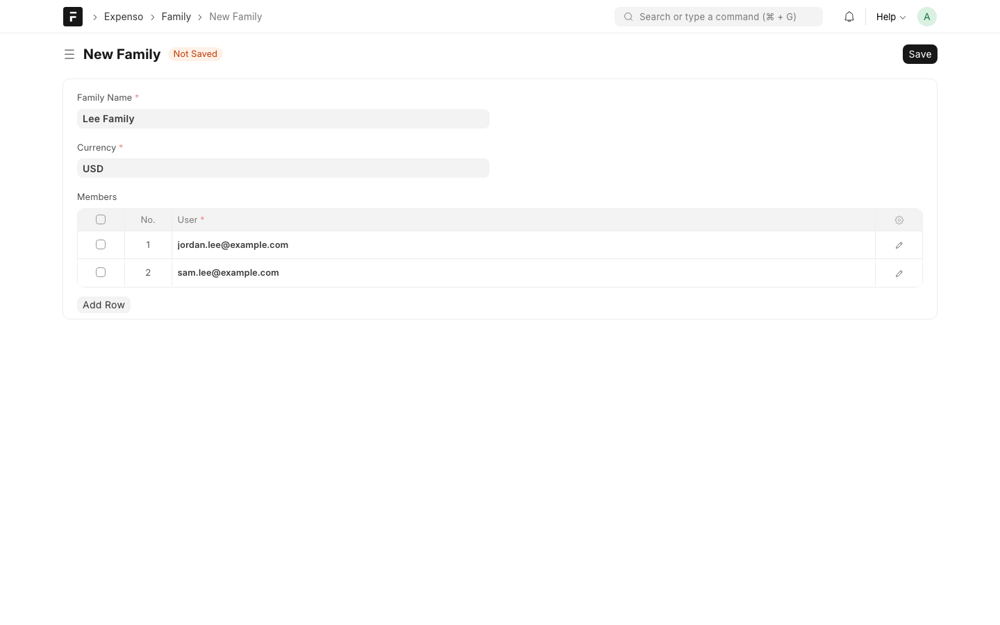 | 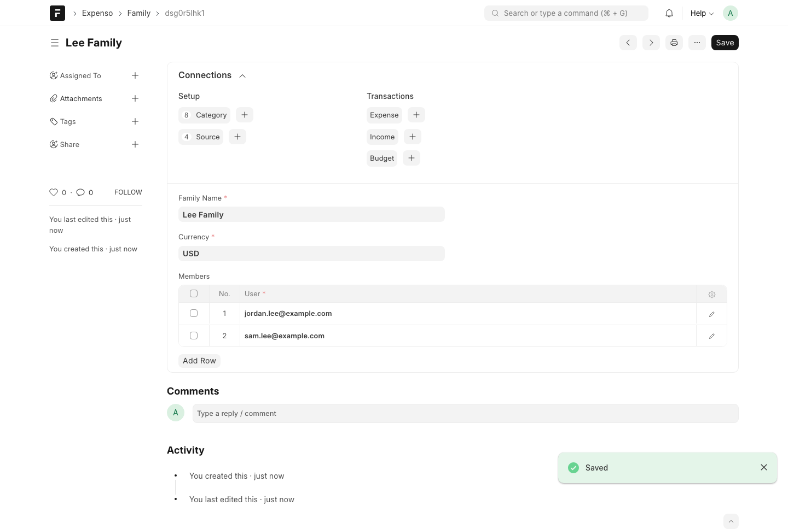 |

## Installation

You can install this app using the [bench](https://github.com/frappe/bench) CLI:

```bash
cd $PATH_TO_YOUR_BENCH
bench get-app $URL_OF_THIS_REPO --branch develop
bench install-app expenso
```

## Testing

### Backend (Python)

Tests run against a Frappe site. Enable tests on the site once, then run any time:

```bash
bench --site <your-site> set-config allow_tests true   # one-time
bench --site <your-site> run-tests --app expenso
```

Covers Expense/Income/Category/Source/Budget validation and lifecycle, the API layer, permissions, and the Frappe Desk Workspace (existence, and that its Number Cards and reports resolve to real doctypes).

### Frontend Unit Tests (Vitest)

Runs in jsdom and covers component logic, but never actually renders CSS — it won't catch a color or layout regression.

```bash
cd frontend
yarn test
```

### UI (Playwright) — visual regression

Fills the CSS gap by screenshotting the Login, Feed, Analytics, and Settings screens and diffing them against committed baselines. Runs against a real, already-running bench site (the app needs live Frappe auth/API responses), so build the frontend and clear the cache first:

```bash
# from apps/expenso/frontend
yarn build

# from the bench root, with $SITE already running
bench --site $SITE clear-cache

# back in apps/expenso/frontend
yarn test:visual        # compare against the committed baselines
yarn test:visual:update # regenerate baselines after an intentional UI change
```

By default it targets `http://127.0.0.1:8005/expenso/`; point it elsewhere with `EXPENSO_TEST_URL=http://host:port/expenso/ yarn test:visual`.

These are a **local dev tool only** — not run in CI. Baseline filenames are OS-specific (e.g. `-darwin`), and the screenshots bake in this site's current seed data, so they'd need a per-platform baseline set and consistent fixture data to run safely in CI.

## Contributing

This app uses `pre-commit` for code formatting and linting. Please [install pre-commit](https://pre-commit.com/#installation) and enable it for this repository:

```bash
cd apps/expenso
pre-commit install
```

Pre-commit is configured to use the following tools for checking and formatting your code:

- ruff
- eslint
- prettier
- pyupgrade

## CI

This app can use GitHub Actions for CI. The following workflows are configured:

- CI: Installs this app, runs backend and frontend unit tests, and builds the frontend on every push to `develop` branch.
- Linters: Runs [Frappe Semgrep Rules](https://github.com/frappe/semgrep-rules) and [pip-audit](https://pypi.org/project/pip-audit/) on every pull request.

## License

MIT
