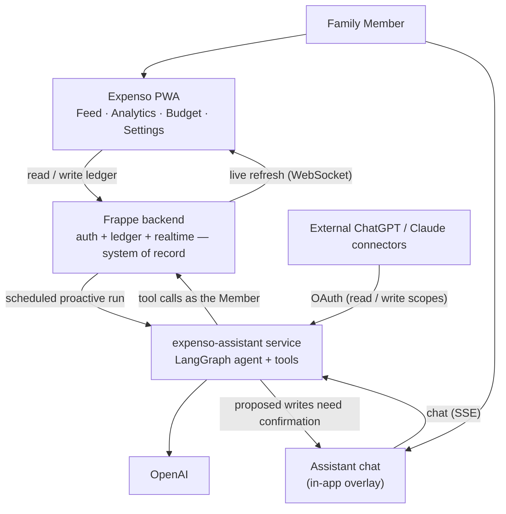
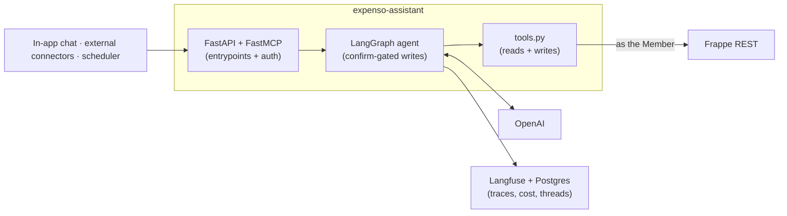
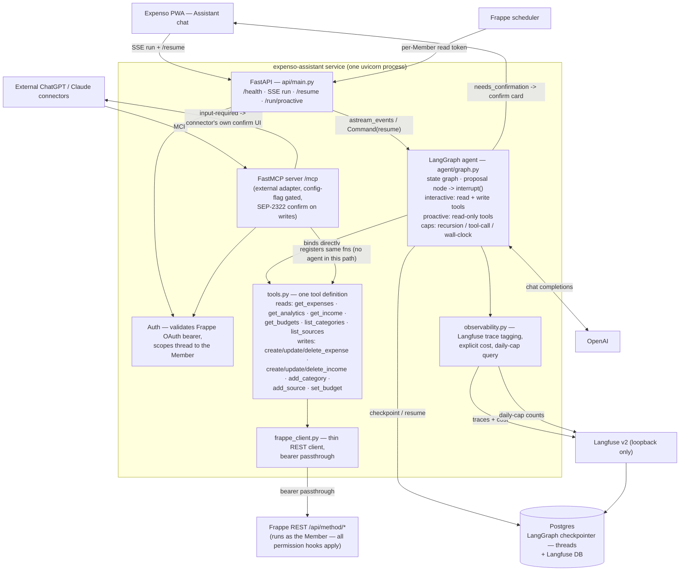

# Architecture

## System Overview

```
Browser (PWA)
  └── Vue 3 SPA (frappe-ui + Tailwind)
        ├── /api/method/*        → Frappe whitelisted methods
        ├── /api/resource/*      → Frappe REST API
        ├── WebSocket (Redis)    → realtime Feed refresh
        │     └── Frappe (Gunicorn) ── MariaDB
        └── SSE  → expenso-assistant service (Assistant chat stream + /resume)
                     ├── LangGraph agent ──── binds tools.py functions directly ──── OpenAI
                     │        └── tools.py  ── Frappe REST /api/method/*  ← as the Member (bearer passthrough)
                     ├── FastMCP server (/mcp) ── registers the same tools.py functions
                     │        └── external ChatGPT/Claude connectors  (pure adapter — disableable)
                     ├── Postgres (LangGraph checkpointer + Langfuse DB)
                     └── Langfuse v2 (loopback only)

Frappe scheduler ──(per-Member read token)──> expenso-assistant /run/proactive
```

### Flow (not code structure)



Frappe stays the OAuth **authorization server** and the system of record for the ledger. It holds **no** LLM dependency or key, and stores **nothing** about the Assistant. Conversation threads live in the service's Postgres; every LLM call and its cost live in Langfuse (there is no `LLM Call Log` DocType — ADR 0008's 2026-09-10 update). See `docs/adr/0008-in-app-assistant-architecture.md`.

---

## Tech Stack

### Backend — Frappe Framework (Python)
- Custom Frappe app (`expenso`): all DocTypes, APIs, and business logic
- MariaDB (Frappe default)
- Redis for caching + Frappe realtime (WebSocket) for live Feed updates
- Frappe's built-in session auth for the app; Frappe's built-in OAuth2 provider is the authorization server for the MCP connector and the in-app Assistant (`expenso-assistant` service). No separate auth service.

### Frontend — Vue 3 SPA (frappe-ui)
- Custom Vue 3 SPA in `frontend/` — **not** the Frappe Desk UI
- **frappe-ui** component library + Tailwind CSS (mobile-first, responsive)
- Vite for build/HMR
- Deployed as a static bundle served by Frappe's Nginx
- PWA (Vite PWA plugin) — installable on Android/iOS home screens

---

## Data Model (DocTypes)

### Phase 1 DocTypes

#### `Family`
| Field | Type | Notes |
|---|---|---|
| `family_name` | Data | display name |
| `currency` | Link → Currency | single currency per family, set at creation |
| `members` | Table (Child) | links to User; two Members expected |

#### `FamilyMember` (Child DocType)
| Field | Type | Notes |
|---|---|---|
| `user` | Link → User | the Member |

#### `Expense`
| Field | Type | Notes |
|---|---|---|
| `amount` | Float | required |
| `date` | Date | defaults to today |
| `category` | Link → Category | optional; `get_query` scopes to Family |
| `notes` | Small Text | optional; free text on what the Expense was for |
| `family` | Link → Family | required |

No `split_among` — there is no split or debt tracking.

#### `Category`
| Field | Type | Notes |
|---|---|---|
| `category_name` | Data | display label, e.g. "Groceries" |
| `family` | Link → Family | required |
| `name` | — | auto (naming series `CAT-.####`) |

`category_name` is not the name key — two Families can each have "Groceries".
Defaults seeded via `Family.after_insert`: `Groceries, Dining, Transport, Utilities, Health, Entertainment, Shopping, Other`.

Amounts displayed via `Intl.NumberFormat` with the Family's currency code.

---

### Phase 2 DocTypes

#### `Income`
| Field | Type | Notes |
|---|---|---|
| `amount` | Float | required |
| `date` | Date | defaults to today |
| `source` | Link → Source | optional; `get_query` scopes to Family |
| `notes` | Small Text | optional; free text on what the Income was for |
| `family` | Link → Family | required |

#### `Source`
| Field | Type | Notes |
|---|---|---|
| `source_name` | Data | display label, e.g. "Salary" |
| `family` | Link → Family | required |
| `name` | — | auto (naming series `SRC-.####`) |

Defaults seeded via `Family.after_insert`: `Salary, Freelance, Rental, Other`.

**Savings** is never stored — always computed as `Income − Expenses` for the selected month.

Income records for the selected month are fetched via a whitelisted `get_income` method (mirroring `get_expenses`), so Feed can list and interleave them with Expenses; realtime events `income_created` / `income_updated` / `income_deleted` refresh Feed the same way the existing `expense_*` events do.

---

### Phase 3 DocTypes

#### `Expenso Budget`

Named `Expenso Budget`, not `Budget` — the plain name collides with ERPNext core's own `Budget` DocType when both apps are installed on one site (issue #83, [ADR 0007](adr/0007-rename-budget-doctype-erpnext-collision.md)). The domain term is still "Budget" everywhere user-facing.

| Field | Type | Notes |
|---|---|---|
| `category` | Link → Category | required; `get_query` scopes to Family |
| `amount` | Float | required; spending cap for this Category, for this month only |
| `month` | Int | required; 1–12 |
| `year` | Int | required |
| `family` | Link → Family | required |

One Budget per Category per Family per (month, year) — enforced in `validate`.
Budget is scoped to a single month. When a month has no Budget row for a Category, the
backend resolves the effective amount by carrying forward the most recent earlier month
that has one (`_resolve_budget_amount` in `api.py`) — no forward-looking carry, and gaps
are not backfilled. `get_analytics` uses this resolution read-only. The Budget screen's
`get_budgets` additionally materializes a real row for the requested month the first time
it's viewed (copying the carried-forward amount), so it becomes editable independently of
other months. Deleting a month's Budget only removes that month's row — carry-forward for
later months resumes from whatever row precedes it. Independent of Income.

**Budget Status** (computed on read, never stored):

| Spent / Budget | State | Display |
|---|---|---|
| < 80% | Normal | no indicator |
| ≥ 80% | Warning | yellow |
| ≥ 100% | Exceeded | red |

---

### Phase 5 additions (shipped) — external MCP connector

`Expense` and `Income` each gain:

| Field | Type | Notes |
|---|---|---|
| `is_external_write` | Check | set only by the `connector` write path (ADR 0006); drives the "unreviewed external write" marker in the detail view |
| `external_write_message` | Small Text | the calling LLM's verbatim request text; stored for audit, never rendered in the app |

Auth: a single admin-configured `OAuth Client` (standard Frappe DocType) with scopes `expenso:read` / `expenso:write`. No new expenso DocType.

---

### Phase 6 additions — the Assistant

#### LLM call telemetry — Langfuse only, nothing in Frappe

The `expenso-assistant` service records every LLM call (chat, insights, receipt extraction) as a **Langfuse trace** — there is no `LLM Call Log` DocType and Frappe stores nothing about the Assistant (ADR 0008's 2026-09-10 update). Each trace carries:

| On the trace | Value |
|---|---|
| `user_id` | the Member the call was for |
| `metadata.family` | the Family |
| `metadata.feature` | `chat` / `receipt` / `insights` |
| `session_id` | the thread id |
| generation cost | computed by the service and attached explicitly (not Langfuse's model-price table) |
| `receipt_accuracy_{amount,date,category,notes}` scores | `receipt` traces only — proposed-vs-confirmed field agreement, posted at `/resume` (ADR 0003) |

The OpenAI API returns **token counts, not cost** (`prompt_tokens` / `completion_tokens`, plus `cached_tokens` and `reasoning_tokens` details). The service computes the dollar figure from a small per-model rate table in `config.py` — `{input, cached_input, output}` per 1M tokens, cached input at its discount, reasoning tokens billed as output — and passes it on the trace.

Admin cost / latency / token visibility is the Langfuse dashboards, browsed over the SSH tunnel. Per-Member daily caps are counted from Langfuse; there is no app-level monthly spend cap (the OpenAI account's hard limit is the backstop).

#### `Expense` / `Income` — new field

| Field | Type | Notes |
|---|---|---|
| `entry_method` | Select | `manual` / `assistant` / `connector` / `receipt` — provenance, orthogonal to `is_external_write`. Only `connector` records are marked "unreviewed". |

#### Not in Frappe

Conversation threads (LangGraph checkpointer's Postgres, in the `expenso-assistant` stack), full agent traces, and every LLM call + its cost (all Langfuse). "Clear chat" deletes the LangGraph thread. There is **no `Chat Message`, no `Chat Run`, and no `LLM Call Log` DocType.**

---

## Assistant Service Architecture

The `expenso-assistant` repo is a standalone service (structured like the sibling `contract-intelligence` project). See `docs/adr/0008-in-app-assistant-architecture.md` for the full rationale.

- **`tools.py`** — one module of typed async functions, the single tool definition (reads: `get_expenses`/`get_analytics`/`get_income`/`get_budgets`/`list_categories`/`list_sources`; writes: `create/update/delete_expense`, `create/update/delete_income`, `add_category`, `add_source`, `set_budget`). Each calls Frappe's REST API as the Member (bearer passthrough).
- **LangGraph agent** — MIT framework; the Elastic-licensed `langgraph-api` server is not used. Two hand-rolled FastAPI endpoints serve it: `astream_events()` → SSE, and `/resume` → `Command(resume=…)`. Postgres checkpointer. **Binds the `tools.py` functions directly** — no MCP in the agent's path. Interactive turns bind read+write tools (writes go through a proposal node → `interrupt()` → confirm card); scheduled (proactive) runs bind read-only tools.
- **FastMCP server (`/mcp`)** — registers the same `tools.py` functions for external ChatGPT/Claude connectors, gating every write behind an SEP-2322 input-required confirmation (the `2026-07-28` MCP era replacement for server-initiated elicitation; the connector renders its own confirm UI). A **pure external adapter**, config-flag gated — disabling it does not affect the in-app Assistant.
- **Auth** — validates the Frappe OAuth bearer, scopes the thread to the owning Member.
- **Observability** — Langfuse v2, self-hosted, Postgres-only, loopback + SSH tunnel. Every trace is tagged `user_id` (Member) / `metadata.family` / `metadata.feature` / `session_id`, with generation cost attached explicitly. This is the only record of a call.
- **Cost bounds** — per-run `recursion_limit` / tool-call / wall-clock caps (the runaway guard); per-Member daily caps (chat / receipt / write) counted from Langfuse, failing open if Langfuse is down. No app-level monthly spend cap — the OpenAI account's hard spend limit is the money backstop.
- **One process, one event loop** — the `app` container runs the FastAPI endpoints + the agent + (optionally) the FastMCP adapter in one uvicorn. Fine at this scale, but proactive runs are scheduled **off-hours** so a tens-of-seconds batch graph can't stall a live chat SSE stream; grow into a separate worker before relaxing that.

### Service internals — components, tools, and interactions

At a glance:



Detail:



---

## Permissions

Pattern is identical for `Expense`, `Income`, and `Expenso Budget`:
- Custom role: **Family Member**
- `permission_query_conditions`: filters to `family = user's single family`
- `has_permission()`: validates requesting user belongs to that Family
- No `if_owner: 1` — any Member may create, edit, or delete any record in their Family

`Category` and `Source` follow the same family-scoping pattern. Rename and delete happen only through Settings; adding a new one can happen either through Settings or inline from the Add Expense/Income sheet (same `add_category` / `add_source` API either way). Deleting is blocked while any Expense (for Category) or Income (for Source) still references the record — Frappe's built-in link-existence check raises `LinkExistsError` on `frappe.delete_doc` for any doctype with existing Link references, so no manual "is it in use" query is needed. Deleting a Category also deletes its Budget rows for every month, since a Budget has no meaning without its Category.

---

## Navigation (mobile)

Bottom navigation bar with 4 tabs + FAB + Chat bubble:
- **Feed tab** — home screen, unified monthly Expense + Income ledger
- **Analytics tab** — monthly financial summary (read-only), including Budget Status per Category
- **Budget tab** — set each Category's Budget amount for the selected month (editing only)
- **Settings tab** — Category/Source list management, logout, version
- **FAB** — bottom-right, on **every** screen (was Feed-only until the Assistant shipped); opens the Add Expense bottom sheet directly, with an Expense/Income tab switcher inside
- **Chat bubble** — bottom-right, on every screen, stacked directly above the FAB with a gap; opens the full-screen Assistant chat overlay. Carries an unread badge when the Assistant has posted an unseen Insight or pending proposal

No Family Switcher — a Member belongs to exactly one Family.

---

## Screens

### Feed
- Reverse-chronological, unified Expense + Income list for the selected month
- Grouped by date (headers: "Today", "Yesterday", "Jun 12"); within each group, Expense and Income rows interleave newest-first together (not clustered by type)
- Each row's primary line is Notes (bold/dark) when present, falling back to Category/Source (Expense) or "No source" (Income) when there is no Notes; Category/Source is otherwise shown as a smaller gray caption below Notes
- Income rows show their amount in green with a leading "+" (e.g. "+$500"); Expense rows are unchanged (dark, no sign)
- Tapping a row opens the matching Edit sheet — Edit Expense or Edit Income
- Summary banner at top shows two stats side by side: Spent this month, Income this month (no Net/Savings here — that stays on Analytics)
- Prev / next month navigation; month state shared with Analytics and Budget
- Silently refreshes via Frappe WebSocket on any add / edit / delete of an Expense or Income in the Family

### Analytics
- **Phase 1:** total spent + Category breakdown (name + amount, no charts)
- **Phase 2 additions:** Income total, Savings line (Income − Expenses)
- **Phase 3 additions:** Budget Status indicator per Category row, budget amount shown alongside spend; a total Budget stat (sum of each Category's effective Budget for the month)
- Stat tiles laid out as a 2×2 grid: Spent / Income on top, Savings / Budget below
- Category breakdown includes any Category with spend this month, an effective Budget this month, or both — a Budget with $0 spent still shows a row; sorted by amount spent descending (zero-spend rows sort last)
- Prev / next month navigation; month state shared with Feed and Budget
- Read-only — no add/edit entry points live here; editing a Budget happens on the Budget screen, adding Income/Expense happens via the Feed FAB

### Add / Edit Expense (bottom sheet)
- Slides up from the Feed FAB (add, defaults to the Expense tab) or tapping an Expense row (edit)
- In add mode, an Expense/Income tab switcher sits at the top of the sheet; tapping "Income" swaps in the Add Income sheet in place. Not shown in edit mode.
- Fields, in order: `amount` (required), `date` (defaults to today), `notes` (optional), `category` (optional)
- Category select includes a trailing "+ New category" option; picking it reveals an inline text input in the sheet to name and create the Category without leaving Add/Edit Expense, then auto-selects it. Rename/delete are not available here — those stay on Settings.
- Delete action behind a confirmation prompt
- Dismissable by tapping outside or swiping down

### Add / Edit Income (bottom sheet) — Phase 2
- Same UX as Expense sheet, including the Expense/Income tab switcher in add mode
- Fields, in order: `amount` (required), `date` (defaults to today), `notes` (optional), `source` (optional)
- Source select includes the same trailing "+ New source" inline-create option as the Category select on the Expense sheet
- Reached from the Feed FAB by switching to the Income tab (no dedicated entry point of its own)

### Budget
- Bottom nav tab, alongside Feed and Analytics
- Lists every Category in the Family with a button showing its Budget amount for the
  selected month (or "Set Budget" if none) — tapping opens the same `BudgetSheet` used
  previously from Settings, now scoped to the selected month
- Prev / next month navigation; month state shared with Feed and Analytics
- Spend and Budget Status are not shown here — see Analytics
- Category list itself (rename, delete) is managed on Settings; adding a new Category can also be done inline from the Add Expense sheet (see above); this screen only reads the list

### Settings
- Reachable via the Settings tab in the bottom nav (alongside Feed, Analytics, Budget)
- **Phase 1:** Category list — rename, delete (delete blocked while an Expense references the Category; also removes its Budgets). Adding a new Category can be done here too, or inline from the Add Expense sheet.
- **Phase 2:** Source list — rename, delete (delete blocked while an Income references the Source). Adding a new Source can be done here too, or inline from the Add Income sheet.
- Budget amounts are managed on the Budget tab, not here
- App version displayed in footer (read from a whitelisted API method at runtime)

> A Member-facing "your usage this month" readout was planned here (old #73) and **dropped for v1** (ADR 0008's 2026-09-10 update) — Members don't pay per call, so it is informational-only and waits for real demand.

### Chat overlay (Assistant) — Phase 6
- Opened by tapping the Chat bubble (present on every screen, stacked above the FAB)
- Full-screen overlay (not a bottom sheet) — scrolling message history + a pinned input
- One continuous private thread per Member; history read from the `expenso-assistant` service
- Sending a message opens an SSE stream: a humanized step log ("Reading March expenses…") streams first, then the answer as prose
- A proposed write appears as a **confirm card** — the literal row(s), a before→after diff for edits, confirm-all / deselect / cancel. Batched: one card per turn for the whole proposed action set
- Attaching a photo → the agent proposes an Expense in a confirm card (receipts). The image is not stored
- "Clear chat" in the header (behind a confirmation) deletes the thread
- Proactive Insights and pending proposals appear inline as Assistant messages

---

## Frontend State

- Selected month lives in a Pinia store; resets to current month on page refresh
- Feed, Analytics, and Budget all read from the same `month` store key
- `useExpenses`, `useCategories`, `useIncome`, `useBudgets` composables own their respective API calls

---

## Login

The Vue SPA uses frappe-ui's `LoginPage` component, which calls Frappe's auth API (`/api/method/login`). Frappe sets the session cookie; the user never leaves the SPA. No separate auth service.

---

## File Layout

```
expenso/                            ← Frappe app root (git repo)
├── docs/
│   ├── ARCHITECTURE.md             ← this file
│   ├── IMPLEMENTATION_PLAN.md
│   ├── DEPLOYMENT.md
│   └── adr/
├── expenso/                        ← Python package
│   ├── __init__.py                 ← __version__ bumped on every commit
│   ├── hooks.py                    ← permission_query_conditions, scheduler_events (Phase 7)
│   ├── assistant/                  ← Phase 6: auth.py (mint_assistant_token), proactive.py
│   ├── expenso/api.py              ← whitelisted ledger methods (the Assistant's tools call these via REST)
│   └── doctype/
│       └── family/ · family_member/ · expense/ · category/ · income/ · source/ · expenso_budget/
│   (expenso/mcp.py — deleted in P6-S4, replaced by the FastMCP server in expenso-assistant)
└── frontend/                       ← Vue 3 SPA
    ├── src/
    │   ├── App.vue                 ← mounts BottomNav + Fab + ChatBubble globally
    │   ├── pages/                  ← Login · Feed · Analytics · Budget · Settings
    │   ├── components/
    │   │   ├── ExpenseSheet.vue · IncomeSheet.vue · BudgetSheet.vue · MonthNav.vue
    │   │   ├── Fab.vue             ← Phase 6: extracted from Feed.vue, global
    │   │   ├── ChatBubble.vue · ChatOverlay.vue · ConfirmCard.vue   ← Phase 6
    │   ├── stores/month.js
    │   ├── composables/
    │   │   ├── useExpenses.js · useCategories.js · useIncome.js · useBudgets.js
    │   │   └── useAssistant.js     ← Phase 6: token mint + SSE stream handling
    │   └── main.js
    └── vite.config.js · package.json

expenso-assistant/                  ← separate repo (Phase 6+); see its own docs/ and ADR 0008
├── docker-compose.yml              ← app + postgres + langfuse:2 + nginx
├── config.py                      ← OPENAI_MODEL + per-model {input,cached_input,output} rate table + per-run/daily caps + MCP_ENABLED (env-driven; no monthly spend cap)
├── tools.py                       ← the one tool definition: typed async fns over frappe_client (ported from expenso/mcp.py)
├── frappe_client.py               ← thin REST client, bearer passthrough
├── mcp_server.py                  ← FastMCP: registers tools.py fns for external connectors (mounted at /mcp iff MCP_ENABLED)
├── agent/                          ← graph.py (binds tools.py directly) · observability.py (Langfuse trace tagging + cost + daily-cap query)
└── api/main.py                    ← FastAPI: /health · SSE run endpoint · /resume · /run/proactive · mounts mcp_server
```
